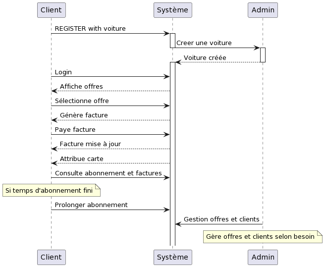
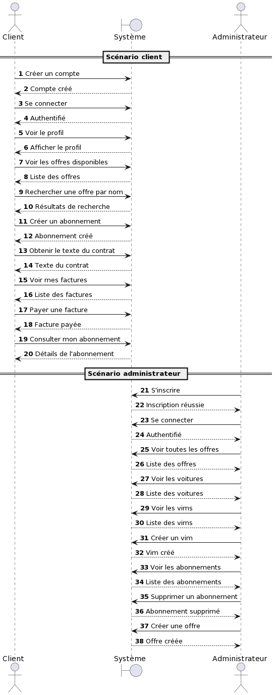
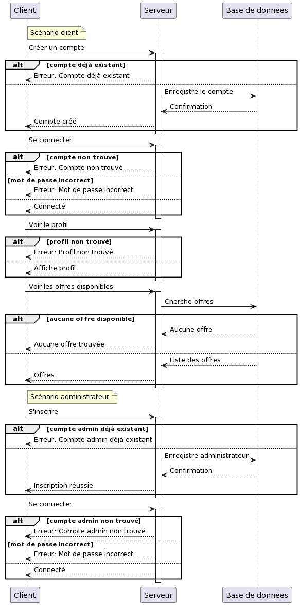
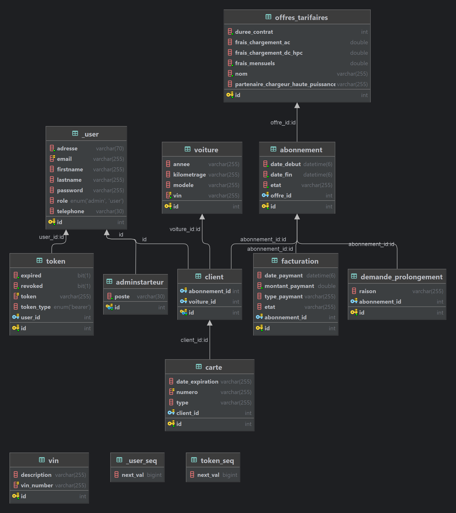
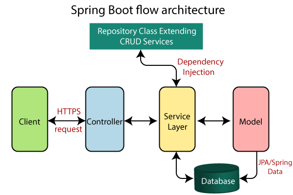

# Nom du Projet : ETRONCAR


## Table des matières

- [Fonctionnalités](#fonctionnalités)
- [Installation](#installation)
- [Utilisation](#utilisation)
- [Contribution](#contribution)
- [Database Schema](#Database Schema)
- [Technologie](#technologie)
- [spring boot Rest API](#spring boot Rest API)
- [JwT](#JwT)


## Fonctionnalités
### diagramme de cas sequence simplifié


### diagramme de cas sequence détaillé


### diagramme de cas sequence détaillé avec erreur  


### Scénario client
- Créer un compte
- Se connecter
- Voir le profil
- Voir les offres disponibles
- Rechercher une offre par nom
- Créer un abonnement
- Obtenir le texte du contrat
- Voir mes factures
- Payer une facture
- Consulter mon abonnement

### Scénario administrateur
- S'inscrire
- Se connecter
- Voir toutes les offres
- Voir les voitures
- Voir les vims
- Créer un vim
- voir les abonnements
- Supprimer un abonnement
- Créer une offre

## Installation

Décrivez ici comment installer et configurer votre projet.

```bash
# Clonez le dépôt
git clone https://github.com/Medhaddadi/eton.git
# Naviguez vers le dossier du projet
cd eton
```

```mysql
INSERT INTO VIN (vin_number, description)
VALUES ('1HGCM82633A123456', 'Exemple de VIN 1'),
('2HGCM82633B234567', 'Exemple de VIN 2'),
('3HGCM82633C345678', 'Exemple de VIN 3'),
('4HGCM82633D456789', 'Exemple de VIN 4'),
('5HGCM82633E567890', 'Exemple de VIN 5');

```
## Database Schema


## Technologie
- Spring Boot 
  - Spring Data JPA
    - Hibernate : ORM 
      - definition : Hibernate est un framework open source gérant la persistance des objets en base de données relationnelle. Il propose une solution performante pour le mapping objet-relationnel (ORM) permettant de faciliter le développement d'applications d'accès aux données.
  - Spring Security
    - JWT
      - definition : JSON Web Token (JWT) est un standard ouvert (RFC 7519) qui définit un moyen compact et autonome pour sécuriser les échanges d'informations entre plusieurs parties sous forme d'objet JSON. Cette information peut être vérifiée et validée facilement car elle est signée numériquement.
  - Spring Web
    - Spring REST
      - definition : REST (REpresentational State Transfer) est un style d'architecture permettant de construire des applications légères, évolutives et performantes, notamment pour les applications web. REST est un style d'architecture, et non un protocole. Il utilise les verbes HTTP (GET, POST, PUT, DELETE) pour manipuler les ressources.
  - Spring Validation
    - definition : Spring Validation est un framework de validation de données. Il permet de valider les données d'un formulaire avant de les enregistrer dans la base de données.
  - Spring DevTools
    - definition : Spring DevTools est un module qui permet de redémarrer automatiquement l'application lorsqu'un changement est détecté dans le code source.
  - Java Faker
    - definition : Java Faker est une bibliothèque Java qui permet de générer des données aléatoires.
  - Lombok
    - definition : Lombok est une bibliothèque Java qui permet de réduire le code source en générant automatiquement les getters et les setters.
  - Log4j
    - definition : Log4j est une bibliothèque Java qui permet de gérer les logs.
- MySQL
## spring boot Rest API 
### Qu'est-ce que Spring Boot ?
Spring Boot est un framework qui permet de créer des applications Java de manière rapide et simple. Il est basé sur Spring et permet de créer des applications autonomes, c'est-à-dire des applications qui ne nécessitent pas de serveur d'application.


Ce schéma illustre l'architecture typique d'une application Spring Boot :

1.  Client  : Il représente l'utilisateur final ou un autre service qui interagit avec l'application Spring Boot. Le client envoie des requêtes HTTPS à l'application.

2.  Controller  : Il s'agit du point d'entrée de l'application Spring Boot pour les requêtes HTTP entrantes. Il traite la requête du client, interagit avec la couche de service (si nécessaire) et renvoie une réponse.

3.  Service Layer  : Cette couche gère la logique métier de l'application. Elle peut impliquer des calculs, des validations, et des interactions avec la couche modèle ou d'autres services. L'injection de dépendance, un concept clé de Spring, permet d'injecter cette couche de service dans le contrôleur.

4.  Model  : Il représente la structure des données avec lesquelles l'application interagit. Ces modèles pourraient être de simples POJOs ou des entités plus complexes interagissant avec une base de données.

5.  Repository Class Extending CRUD Services  : Dans l'écosystème Spring Data JPA, la couche de répertoire offre des opérations CRUD sans avoir besoin de code supplémentaire. Cela minimise la nécessité d'écrire des requêtes SQL personnalisées.

6.  Database  : C'est là que les données de l'application sont stockées et gérées. Le modèle interagit avec la base de données, souvent via des outils ORM comme JPA.

7.  Dependency Injection  : C'est un concept clé de Spring qui promeut l'injection de dépendances dans les composants. Cela conduit à une meilleure modularité et découplage dans les applications.

8.  JPA/Spring Data  : JPA est une spécification pour l'accès aux données. Spring Data l'améliore en fournissant des fonctionnalités supplémentaires.

En bref, cette architecture favorise une séparation des préoccupations, où chaque couche a sa propre responsabilité, rendant le système modulaire et facile à maintenir.
## JwT

### Qu'est-ce que JWT ?
JSON Web Token (JWT) est un standard ouvert (RFC 7519) qui définit un moyen compact et autonome pour sécuriser les échanges d'informations entre plusieurs parties sous forme d'objet JSON. Cette information peut être vérifiée et validée facilement car elle est signée numériquement.


